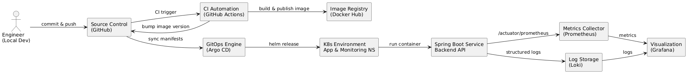
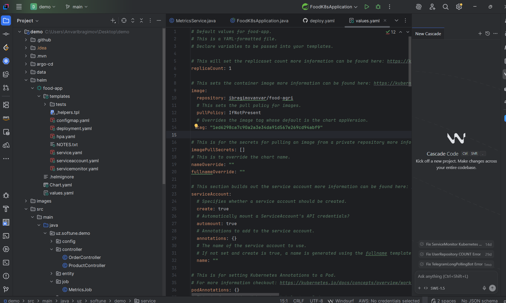
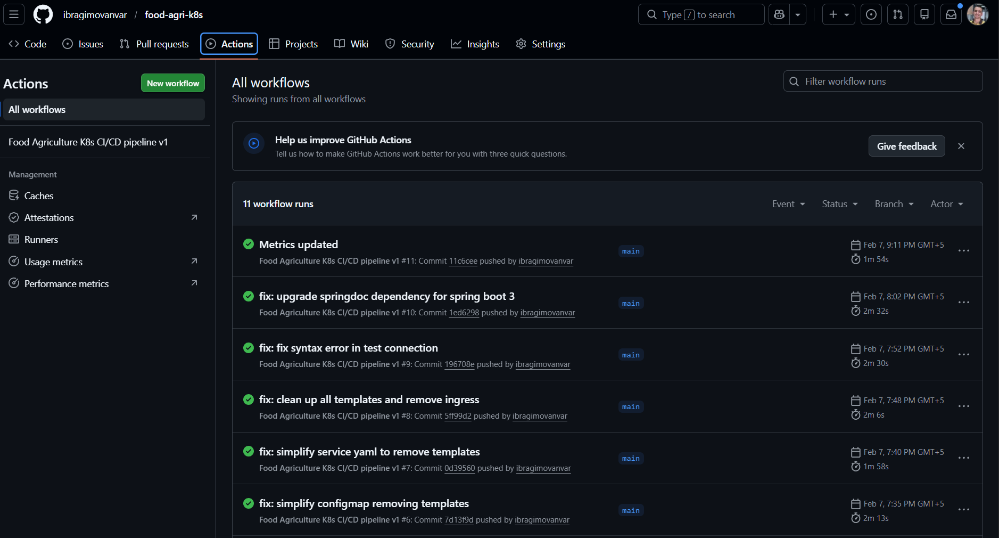
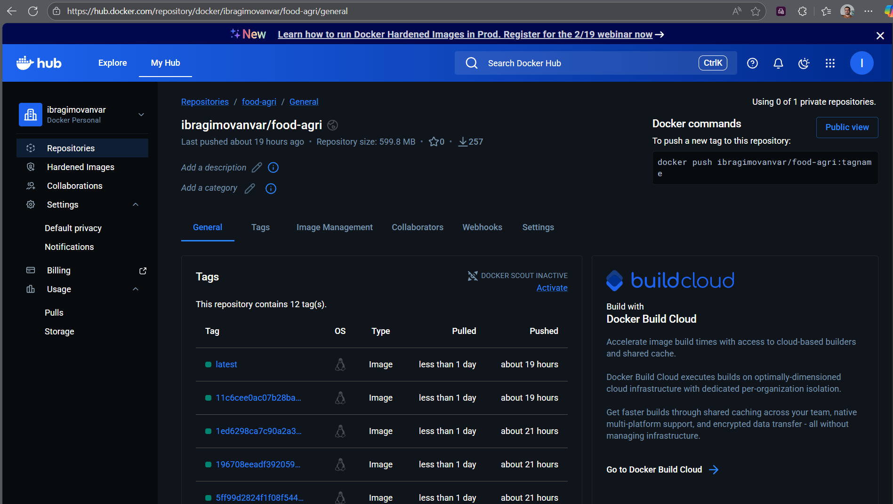
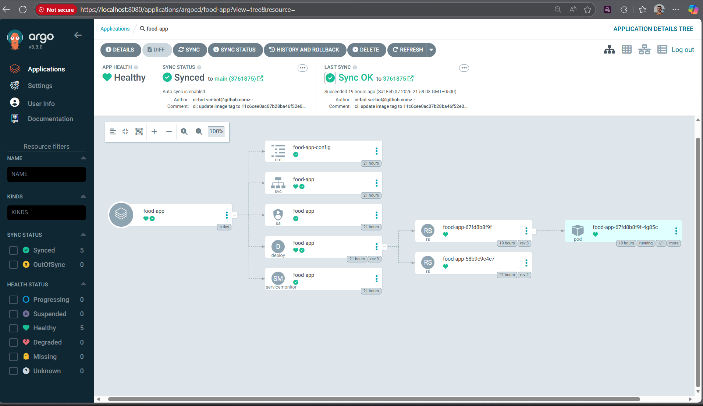
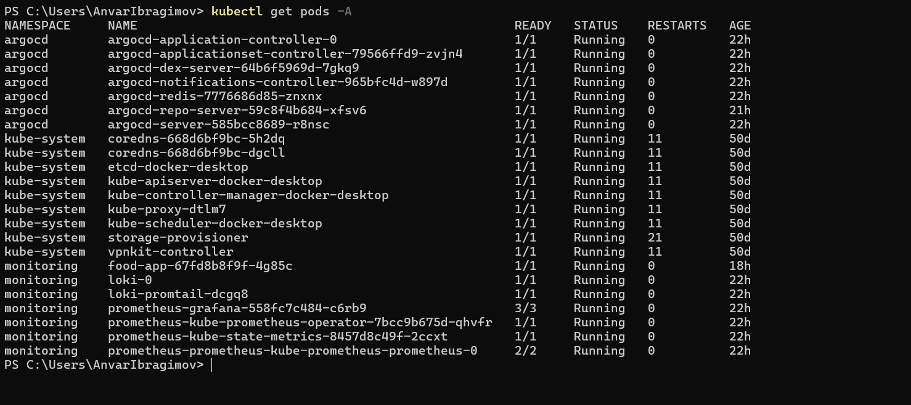
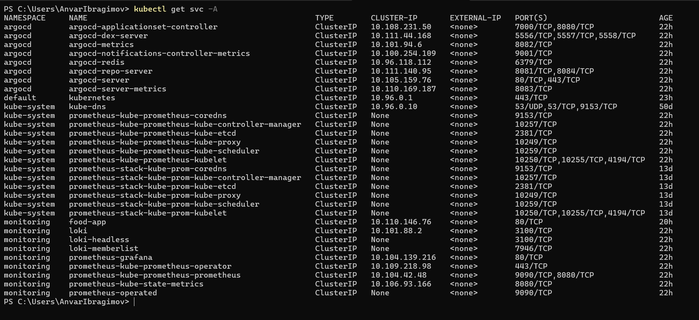
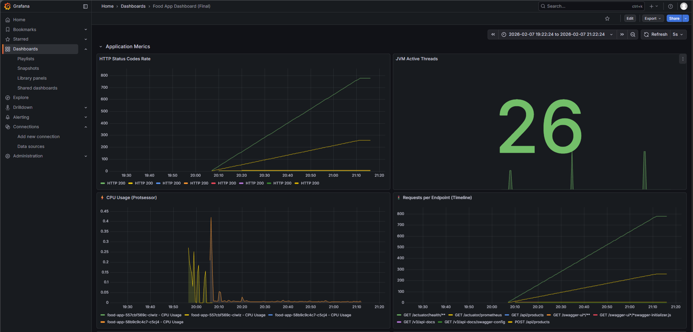
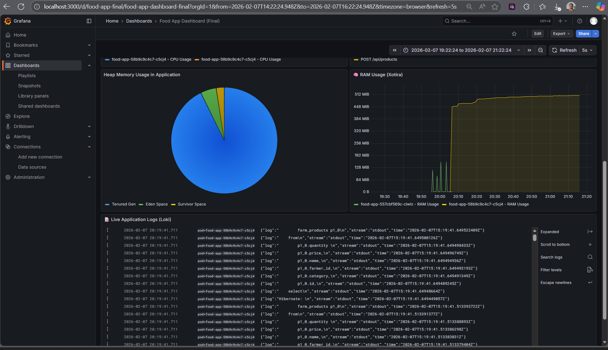
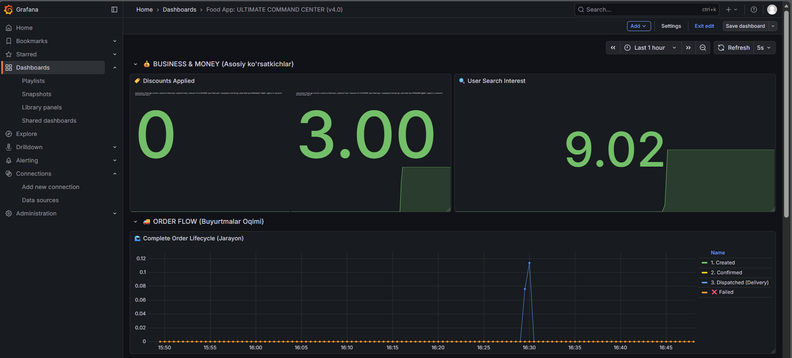

# Food Agriculture Prepare — DevOps PoC & Technical Documentation

## Overview

This project demonstrates a **DevOps-based Digital Procurement Platform for Agriculture & Food Production**, implemented as part of a practical DevOps assignment. The solution showcases how modern DevOps practices can be applied to design, deploy, monitor, and operate a cloud-native application in a reliable and scalable manner.

The system is built around a Spring Boot application that manages farm products, orders, and notifications. It is deployed to a Kubernetes cluster using **Helm** and **ArgoCD (GitOps)**, with full CI/CD automation via **GitHub Actions**. Observability is implemented using **Prometheus**, **Grafana**, and **Loki**, including custom business metrics and structured application logs.

This repository acts as both a **Proof of Concept (PoC)** and **technical documentation**, covering the full DevOps lifecycle: development, automation, deployment, monitoring, and continuous improvement.

---

## Tech Stack

| Layer                | Technology                   |
| -------------------- | ---------------------------- |
| Language & Framework | Java 21, Spring Boot         |
| Build Tool           | Maven                        |
| Containerisation     | Docker                       |
| CI/CD                | GitHub Actions               |
| Container Registry   | Docker Hub                   |
| Orchestration        | Kubernetes                   |
| Packaging            | Helm                         |
| GitOps CD            | ArgoCD                       |
| Monitoring           | Prometheus                   |
| Dashboards           | Grafana                      |
| Logging              | Loki                         |
| Observability        | Micrometer + Spring Actuator |

---

## High-Level Architecture

* **Developers push code** → **GitHub Actions** builds image → pushes to **Docker Hub** → updates **Helm values** (image tag) → **ArgoCD** syncs Helm chart from Git repo → **Kubernetes cluster** (namespace `food-app` / `monitoring`) runs app + monitoring stack.
* **Prometheus** scrapes Spring Boot actuator `/actuator/prometheus` and monitoring exporters.
* **Grafana** reads Prometheus for metrics and Loki for logs.


---

## Repository Structure



```text
.
devops-assignment-main/
├── .github/
│   └── workflows/
│       └── deploy.yaml
│
├── argocd/
│   ├── application.yaml
│   └── application-prometheus.yaml
│
├── images/
│   ├── github-actions.png
│   ├── docker-hub-repo.png
│   ├── argo-cd.png
│   ├── lens-pods.png
│   ├── lens-services.png
│   ├── app-default-metrics.png
│   ├── app-custom-metrics.png
│   ├── notification-metrics.png
│   └── app-custom-logs.png
│
├── helm/
│   └── food-app/
│       ├── Chart.yaml
│       ├── values.yaml
│       └── templates/
│           ├── deployment.yaml
│           ├── service.yaml
│           ├── serviceaccount.yaml
│           ├── servicemonitor.yaml
│           ├── configmap.yaml
│           ├── ingress.yaml
│           ├── hpa.yaml
│           └── _helpers.tpl
│
├── src/
│   └── ... (Java Source Code as shown in IDE Screenshot)
├── Dockerfile
├── pom.xml
└── README.md

```
## API Endpoints

### Farm Products

| Method | Endpoint                          | Description        |
| ------ | --------------------------------- | ------------------ |
| GET    | `/api/products`                   | Get all products   |
| GET    | `/api/products/farmer/{farmerId}` | Products by farmer |
| POST   | `/api/products`                   | Add product        |
| PUT    | `/api/products/{id}`              | Update product     |
| DELETE | `/api/products/{id}`              | Remove product     |

### Orders

| Method | Endpoint      | Description |
| ------ | ------------- | ----------- |
| POST   | `/api/orders` | Place order |
| GET    | `/api/orders` | List orders |

---

## CI/CD Pipeline (GitHub Actions)

The CI/CD pipeline automates:

1. Code checkout
2. Maven build (Java 21)
3. Docker image build
4. Image push to Docker Hub
5. GitOps update of Helm image tag

📸 **Evidence**


---

## Docker Image Registry

Docker images are published automatically with commit SHA tags and `latest`.

📸 **Evidence**


---

## Kubernetes Deployment (Helm)

The application is deployed via Helm using:

* Deployment
* Service (ClusterIP)
* ConfigMap
* ServiceMonitor (Prometheus integration)

**Relevant Helm values**

```yaml
image:
  repository: ibragimovanvar/food-agri
  tag: "<git-sha>"

serviceMonitor:
  enabled: true
  path: /actuator/prometheus
  interval: 50s
  additionalLabels:
    release: prometheus
```

---

## GitOps Deployment (ArgoCD)

ArgoCD continuously syncs the Helm chart from GitHub and deploys it to Kubernetes.

* Automated sync
* Self-healing enabled
* Namespace: `monitoring`

📸 **Evidence**


---

## Cluster Visibility

Pods and services are validated using Lens to ensure successful deployment.

📸 **Evidence**



---

## Monitoring & Custom Metrics (Prometheus + Grafana)

### Default Application Metrics

* JVM memory
* Threads
* HTTP requests

📸 **Evidence**


### Custom Business Metrics

Implemented using **Micrometer**:

#### Order Metrics

* Orders confirmed
* Processing duration

📸 **Evidence**


#### Farm Product Metrics

* Additions, updates, removals
* Failed updates
* Processing time
* Updates per minute

#### Notification Metrics

* Sent / failed notifications
* Sent / failed notifications by time

📸 **Evidence**


---

# 🌱 FoodApp Monitoring & Metrics

This document describes all **application metrics** exposed via **Micrometer** and **Prometheus**. These metrics help monitor system health, performance, and business activity.

---

## 📊 Metrics Overview

The application provides metrics for:

* Farm product lifecycle
* Inventory health
* Orders & delivery
* Notifications
* User & business activity

All metrics are available via the `/actuator/prometheus` endpoint.

---

## 🌱 Farm Product Metrics

**Total number of products added**

```promql
foodapp_farm_product_additions_total
```

**Total number of products updated**

```promql
foodapp_farm_product_updates_total
```

**Total number of products removed**

```promql
foodapp_farm_product_removals_total
```

**Failed product updates**

```promql
foodapp_farm_product_update_failures_total
```

**Product updates per minute**

```promql
rate(foodapp_farm_product_updates_total[1m])
```

**Average time to add a product (ms)**

```promql
rate(foodapp_product_addition_duration_seconds_sum[5m])
/
rate(foodapp_product_addition_duration_seconds_count[5m])
* 1000
```

**Average time to update a product (ms)**

```promql
rate(foodapp_product_update_duration_seconds_sum[5m])
/
rate(foodapp_product_update_duration_seconds_count[5m])
* 1000
```

**Current total number of products (Gauge)**

```promql
foodapp_total_products
```

---

## 🧊 Inventory Health Metrics

**Total spoiled or wasted products**

```promql
foodapp_product_spoilage_total
```

**Low stock alerts triggered**

```promql
foodapp_inventory_low_stock_alerts_total
```

---

## 🛒 Order & Delivery Metrics

**Total orders created**

```promql
foodapp_orders_created_total
```

**Orders confirmed per minute**

```promql
rate(foodapp_orders_confirmed_total[1m])
```

**Failed orders**

```promql
foodapp_orders_failed_total
```

**Order failure rate**

```promql
rate(foodapp_orders_failed_total[5m])
```

**Average order processing time (ms)**

```promql
rate(foodapp_order_processing_duration_seconds_sum[5m])
/
rate(foodapp_order_processing_duration_seconds_count[5m])
* 1000
```

**Active orders in the system (Gauge)**

```promql
foodapp_active_orders
```

**Orders dispatched for delivery**

```promql
foodapp_delivery_dispatched_total
```

**Discounts / promo codes applied**

```promql
foodapp_discounts_applied_total
```

---

## 🔔 Notification Metrics

**Total notifications sent**

```promql
foodapp_notifications_sent_total
```

**Total notification failures**

```promql
foodapp_notifications_failed_total
```

**Notification retry count**

```promql
foodapp_notification_retries_total
```

**Notification success rate (%)**

```promql
100 *
rate(foodapp_notifications_sent_total[5m])
/
(
  rate(foodapp_notifications_sent_total[5m])
+ rate(foodapp_notifications_failed_total[5m])
)
```

**Average notification latency (ms)**

```promql
rate(foodapp_notification_latency_seconds_sum[5m])
/
rate(foodapp_notification_latency_seconds_count[5m])
* 1000
```

---

## 👤 User & Business Metrics

**Total search queries**

```promql
foodapp_search_queries_total
```

**Failed user login attempts**

```promql
foodapp_user_login_failures_total
```

**Farmer payouts processed**

```promql
foodapp_farmer_payouts_total
```

---

## ✅ Notes

* All metrics follow Prometheus naming conventions
* Timers are exported as `_sum` and `_count`
* Gauges represent real-time system state

---

## Assignment Evidence Summary

✔ Local code

✔ GitHub Actions CI

✔ Docker Hub images

✔ ArgoCD GitOps deployment

✔ Kubernetes pods & services

✔ Default & custom Grafana metrics

✔ Loki application logs

All screenshots are available in the `images/` directory.

---


## Local Run Handbook

This section explains how to run the **Food & Agriculture DevOps Platform** locally, including the application, Kubernetes, GitOps deployment, and monitoring stack.

---

### Prerequisites

Make sure the following tools are installed locally:

* **Java 21**
* **Maven**
* **Docker**
* **kubectl**
* **Helm**
* **kind** (Kubernetes-in-Docker)
* **Git**

---

### 1. Clone the Repository

```bash
git clone https://github.com/ibragimovanvar/food-agri-k8s.git
cd food-agri-k8s
```

---

### 2. Run the Application Locally (Optional – Dev Mode)

This is useful to quickly verify APIs and metrics.

```bash
./mvnw spring-boot:run
```

Verify:

* API: `http://localhost:8080/api/products`
* Metrics: `http://localhost:8080/actuator/prometheus`

Stop the app before continuing with Kubernetes.

---

### 3. Create Local Kubernetes Cluster (kind)

```bash
kind create cluster --name kind-devops-agro
kubectl cluster-info
```

---

### 4. Install Monitoring Stack (Prometheus, Grafana, Loki)

```bash
helm repo add prometheus-community https://prometheus-community.github.io/helm-charts
helm repo add grafana https://grafana.github.io/helm-charts
helm repo update
```

Install kube-prometheus-stack:

```bash
helm install prometheus prometheus-community/kube-prometheus-stack \
  --namespace monitoring \
  --create-namespace
```

Install Loki:

```bash
helm install loki grafana/loki-stack \
  --namespace monitoring
```

---

### 5. Build and Push Docker Image
Here I am mentioning my docker hub repo, use yours.
```bash
docker build -t ibragimovanvar/food-food-agri:local .
docker push ibragimovanvar/food-food-agri:local
```

---

### 6. Deploy Application Using Helm

```bash
helm upgrade --install food-app ./helm/food-app \
  --namespace monitoring \
  --create-namespace
```

This deploys:

* Spring Boot app
* Service
* ConfigMap
* ServiceMonitor (Prometheus scraping)

---

### 7. Install ArgoCD (GitOps)

```bash
kubectl create namespace argocd
kubectl apply -n argocd \
  -f https://raw.githubusercontent.com/argoproj/argo-cd/stable/manifests/install.yaml
```

Access ArgoCD UI:

```bash
kubectl port-forward svc/argocd-server -n argocd 8080:443
```

URL: `https://localhost:8080`

Get admin password:

```bash
kubectl get secret argocd-initial-admin-secret \
  -n argocd -o jsonpath="{.data.password}" | base64 -d
```

---

### 8. Deploy App via ArgoCD (GitOps Flow)

Apply the ArgoCD Application:

```bash
kubectl apply -f argocd/application.yaml
```

ArgoCD will:

* Pull Helm chart from GitHub
* Detect image tag updates
* Sync automatically to Kubernetes

---

### 9. GitHub Actions CI/CD Setup

Add the following **GitHub Secrets**:

* `DOCKER_HUB_USERNAME` → `ibragimovanvar` as example, use your docker hub username
* `DOCKER_HUB_PASSWORD` → your Docker Hub access token

On every push to `main`:

* GitHub Actions builds the image
* Pushes to Docker Hub
* Updates Helm `values.yaml`
* ArgoCD automatically deploys the new version

---

### 10. Monitoring & Logs Verification

#### Grafana

```bash
kubectl port-forward svc/prometheus-grafana -n monitoring 3000:80
```

URL: `http://localhost:3000`
(Default user/pass: `admin / prom-operator`)

#### Logs (Loki)

Logs are formatted to show **only business messages**:

```text
Food-App: INFO: Order placed [orderId=51, farmerId=farmer-55]
```

Explore logs via **Grafana → Explore → Loki**